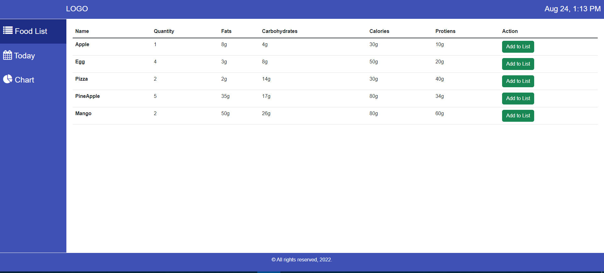
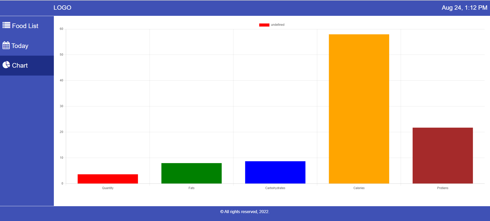

# DietDashboard

This project was generated with [Angular CLI](https://github.com/angular/angular-cli) version 13.0.1.

## Development server

Run `npm install` for installing packages

Run `npm start` for a dev server. Navigate to `http://localhost:4200/`. The app will automatically reload if you change any of the source files.

## Build

Run `ng build` to build the project. The build artifacts will be stored in the `dist/` directory.

## Food Items List 

## Today's Menu List 

## Chart

